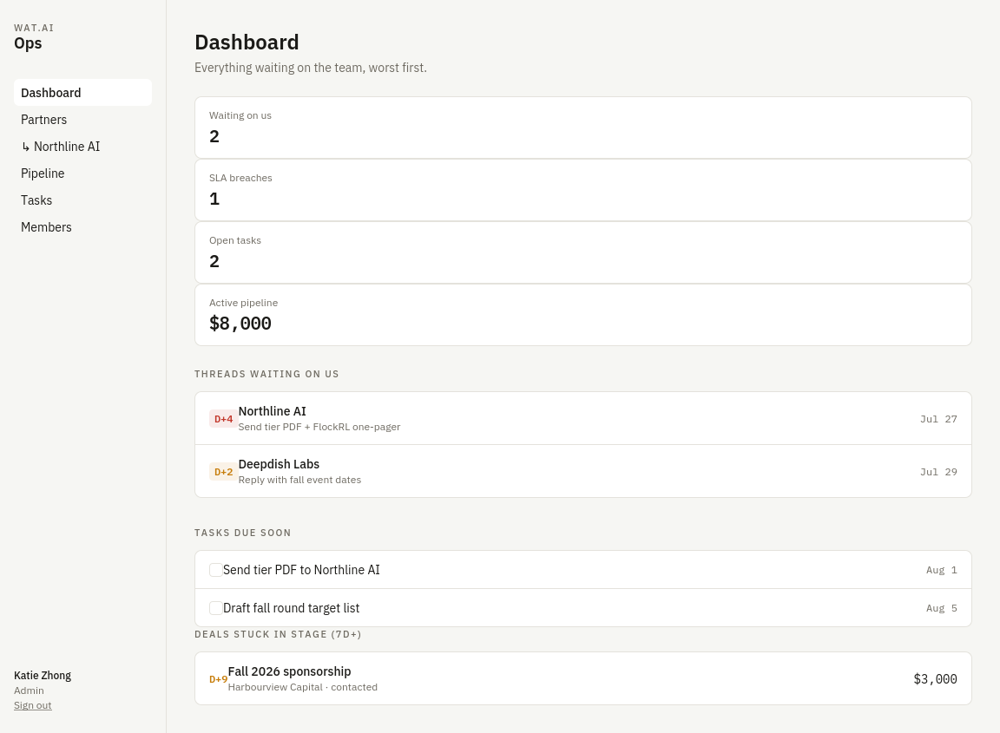
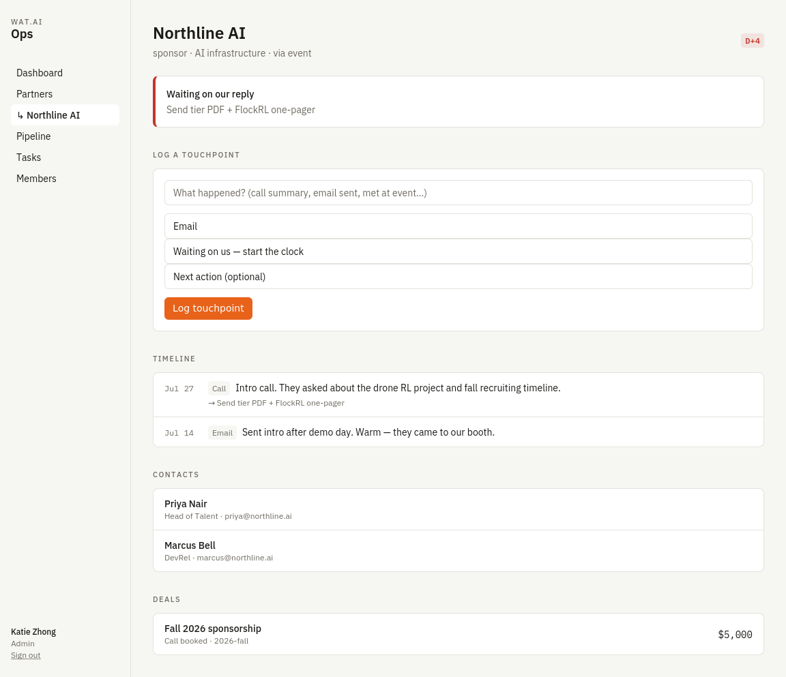
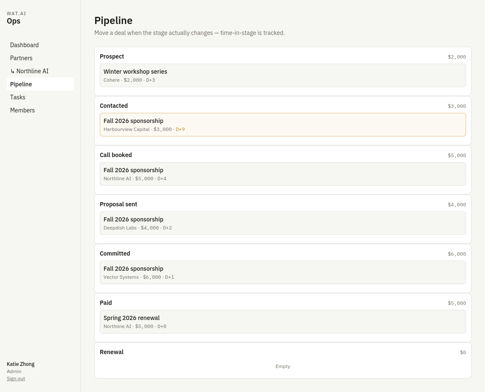
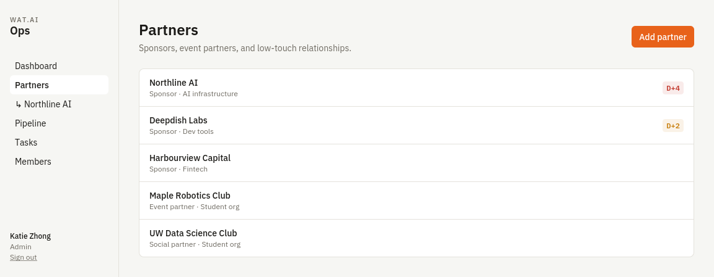
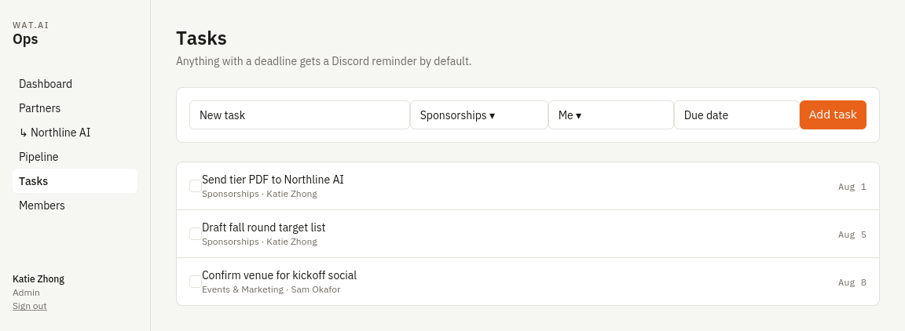
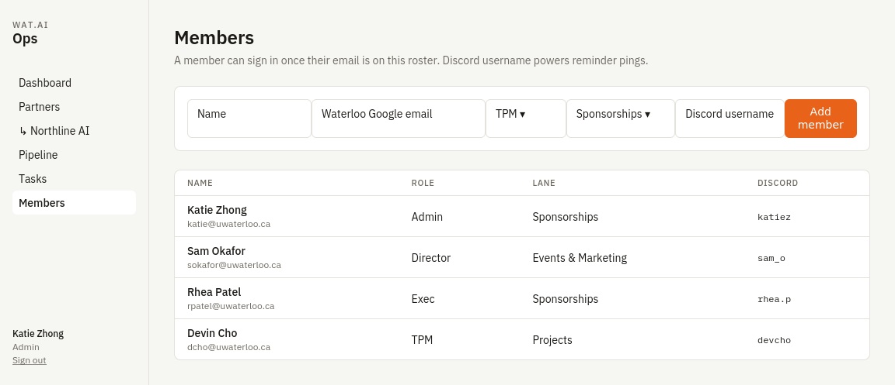

# WAT.ai Ops

Partnership + operations platform for [WAT.ai](https://watai.ca) — the University of Waterloo's largest AI student engineering team. Built to be more than a spreadsheet: relationship history that survives leadership turnover, a visible 3-day reply SLA, a deal pipeline with time-in-stage tracking, and Discord-native reminders.

Built for WAT.ai first; designed to generalize to any student team (lanes and roles are config, not code). See [`CLAUDE.md`](./CLAUDE.md) for the full product spec, architecture decisions, and roadmap.

**▶ [Open the live demo](https://katie-zhong.github.io/watai-opal/)** — a static, no-login walkthrough with mock data.

---

## Screenshots

### Dashboard — everything waiting on the team, worst first
The 3-day SLA clock is the signature: `D+n` counters go green → amber → red, and breached threads sort to the top.



### Partner detail — a timeline that outlives whoever owned the relationship
Most-urgent info up top, full touchpoint history, contacts, and deals below.



### Pipeline — deals by stage with time-in-stage flags
Deals stuck 7+ days in a stage get flagged amber so nothing quietly stalls.



<details>
<summary>More screens — Partners, Tasks, Members</summary>

**Partners**


**Tasks** — universal task primitive with lanes, assignees, and Discord reminders on by default


**Members** — team roster; role drives access, Discord username powers reminder pings


</details>

---

## What's in MVP 1 (V0)

- **Dashboard** — every thread waiting on the team, sorted worst-first with SLA day counters, tasks due soon, and deals stuck in stage 7+ days
- **Partners** — sponsor / event partner / social partner records with touchpoint timelines, contacts, and deals
- **Pipeline** — deals across seven stages with time-in-stage flags and CAD/USD amounts
- **Tasks** — universal task primitive with lanes, assignees, deadlines, and Discord reminders on by default
- **Members** — team roster with roles (admin / exec / director / TPM), lanes, and Discord usernames
- **Discord reminders** — daily cron posts SLA breaches and due tasks to a webhook
- **Auth + RBAC** — Google sign-in, allowlist by member email, role-tiered row-level security in Postgres

On the roadmap (see [`CLAUDE.md`](./CLAUDE.md)): Google Drive folder indexing + AI briefs, Gmail sequences, events and finance modules, Interac e-transfer parsing, analytics dashboards.

## Stack

Next.js 14 (App Router, server actions) · Supabase (Postgres, Auth, RLS) · Tailwind · Vercel (hosting + cron)

## Run it for real

1. **Supabase project**
   - Create a project at [supabase.com](https://supabase.com)
   - Run `supabase/migrations/0001_init.sql` in the SQL editor
   - Edit `supabase/seed.sql` — replace `you@uwaterloo.ca` with your Google email — then run it
   - Enable the Google provider under Authentication → Providers (create OAuth credentials in Google Cloud Console; add your Supabase callback URL)

2. **Environment**
   ```bash
   cp .env.example .env.local
   ```
   Fill in your Supabase URL + anon key. Optionally add a Discord webhook URL and a `CRON_SECRET`.

3. **Run**
   ```bash
   npm install
   npm run dev
   ```
   Sign in with the Google account matching your seeded member email.

4. **Deploy (optional)**
   - Push to GitHub, import into Vercel, add the env vars
   - For Discord reminders, also set `SUPABASE_SERVICE_ROLE_KEY` (server-only) so the cron route can read data without a user session
   - `vercel.json` schedules the reminder check daily at 13:00 UTC

## The demo

The [live demo](https://katie-zhong.github.io/watai-opal/) is a self-contained static build in [`docs/`](./docs) — mock data, no backend, forms inert. It's what GitHub Pages serves and what the screenshots above are rendered from. To run it locally, open `docs/index.html` in a browser.

## Design notes

- **The SLA clock is the signature.** `D+n` mono counters appear wherever a thread is waiting on the team; the dashboard sorts them worst-first. The whole product exists so nothing sits past day 3.
- **Four primitives** (entity records, tasks, approvals, activity log) back every feature — new modules are new views, not new infrastructure.
- **Log everything.** Every mutation writes to `activity_log`, so metrics and digests can be built later without backfilling.

## License

MIT
